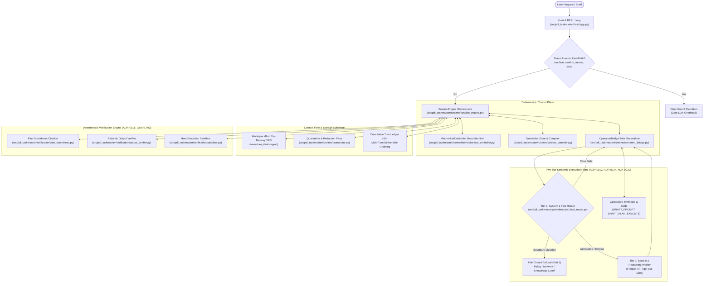
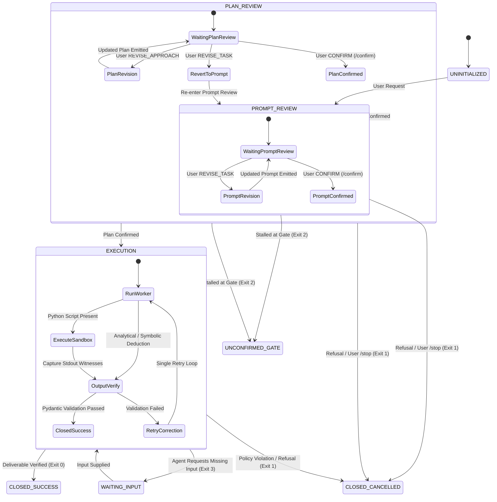
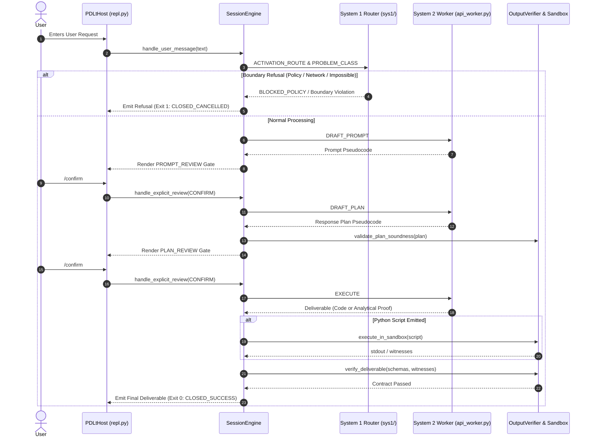

# PDL Taskmaster — Systems Architecture & Execution Blueprint

**System Lineage**: `v2.0.0` $\to$ `v2.4.0` $\to$ `v2.5.1` $\to$ `v2.6.0` (Active Production Baseline)  
**Chartered Consensus ID**: `49ac3d41` (via `waymark-engine`)  
**Base Lineage Ratifications**: ADR-0001 through ADR-0020; TRD-0001 through TRD-0003; Normative Guardrails (`GUARD-01` through `GUARD-05`)  

---

## 1. Executive Summary & Core Philosophy

**PDL Taskmaster (`pdl-taskmaster`)** is a controller-gated, deterministic alignment harness and dual-plane runtime governor designed to solve the foundational dilemma of autonomous agent systems: *the component carrying out the task cannot be the sole entity deciding what the task means*.

The harness enforces three non-negotiable mandates:
1. **Fidelity (Evidence I)**: A task must be executed strictly as the requester intended, not as the model prefers to interpret it—ensuring accurate actor attribution (`SEM-05`), explicit ambiguity surfacing, and strict preservation of technical contracts (`TASK-01`).
2. **Containment (Evidence II)**: Content arriving *inside* a task (quoted text, documents, embedded user instructions) must remain passive data. Through architectural semantic bootstrap containment (`BOOTSTRAP_ANALYSIS`), raw untrusted input is physically quarantined from compilation operations, while downstream deliverables and entities are screened through native DLP sanitization (`SEM-06`).
3. **The Referee Invariant (`GUARD-01` through `GUARD-05`)**: The harness is strictly an **objective protocol governor and referee**, never an AI task solver. The harness enforces protocol boundaries, review stages, schema conformance, and execution sandboxing—but MUST NEVER inject algorithmic advice, coach the model with domain heuristics, require specific algorithmic keywords in review gates, or fabricate synthetic witnesses. **A failed benchmark is acceptable and diagnostic of genuine model capability boundaries, but a gamed benchmark is a critical integrity breach.**



---

## 2. Subsystem Topology & Directory Blueprint

```
PDL-Standard-REPL-Harness/
├── contracts/                        # Normative authorities & execution bindings
│   ├── standards/                    # Immutable standard specifications (*.md)
│   ├── AUTHORITY_MAP.json            # Normative authority hierarchy
│   ├── CALIBRATION.json              # Confidence calibration parameters
│   ├── CONTRACT_MANIFEST.json        # Hash-pinned contract manifest (GUARD-05)
│   ├── EXECUTION_CONTRACT.json       # Per-operation input/output symbols & clauses
│   ├── IMPLEMENTATION_BOUNDARY.json  # Platform & environment boundary definitions
│   └── VERIFICATION_CONTRACT.json    # Automated stage verification requirements
├── docs/                             # Architecture specifications & decision records
│   ├── adr/                          # Architectural Decision Records (ADR-0001..0020)
│   ├── architecture/                 # Whitepapers & framing specifications
│   ├── governance/                   # Roadmap, experiment logs, and release plans
│   ├── guardrails/                   # ANTI_OVERFITTING_AND_BENCHMARK_INTEGRITY.md (SSOT)
│   └── trd/                          # Technical Requirement Documents (TRD-0001..0003)
├── src/pdl_taskmaster/               # Packaged Python distribution root
│   ├── contracts/                    # Bundled normative contracts & AUTHORITY_MAP.json
│   ├── controller/                   # Deterministic state machine & transition rules
│   │   ├── mechanical_controller.py  # Stage, Intent, Transition, MechanicalController
│   │   └── schemas/                  # Wire and deliverable validation schemas
│   ├── host/                         # User-facing terminal REPL, pdlt CLI, and host loop
│   │   ├── app.py                    # PDLtHost process and turn lifecycle manager
│   │   ├── cli.py                    # pdlt umbrella command line entry point
│   │   └── repl.py                   # Terminal loop, fast paths, and argument parsing
│   ├── providers/                    # Execution worker backends & classifiers
│   │   ├── api_worker.py             # System 2 OpenAI-compatible API client (e.g. gpt-oss-120b)
│   │   ├── fixtures.py               # Fixture builder for deterministic test replay
│   │   ├── live_stub.py              # Offline deterministic test worker
│   │   └── sys1/                     # System 1 Fast Router (<200ms discrete classifier)
│   │       ├── decision_head.py      # Confidence-calibrated decision engine
│   │       ├── fast_router.py        # Dual-Plane router orchestration
│   │       └── recipes/              # Discrete classification recipes
│   │           ├── activation_route.py # Boundary refusal (env vars, network, cutoff)
│   │           ├── problem_class.py    # Problem classification
│   │           └── review_intent.py    # Review confirmation parsing (CONFIRM, REVISE)
│   ├── runtime/                      # Core protocol orchestrator and data plane
│   │   ├── context_compiler.py       # Per-operation prompt projection compiler
│   │   ├── normative_store.py        # 4-tier precedence standards resolver
│   │   ├── operation_bridge.py       # Wire serializer, deserializer, and schema parser
│   │   ├── quarantine.py             # D29 generalized canary and IOC redaction pass
│   │   ├── result_ir.py              # TRD-0003 Result IR decomposition and verifier
│   │   ├── session_engine.py         # SessionEngine core dual-plane orchestrator
│   │   ├── wire_payloads.py          # Pydantic v2 wire models (ADR-0010)
│   │   └── workspace.py              # Context-flow workspace and turn hierarchy (S3/S4)
│   ├── verification/                 # Deterministic verification & host execution engine
│   │   ├── checkers/                 # Domain-specific verifiers (partition_sum_triples.py)
│   │   ├── output_verifier.py        # Pydantic SSOT contract validator (ADR-0018)
│   │   ├── plan_soundness.py         # Grammar & PDL rule compliance checker (PDL-01..08)
│   │   └── sandbox.py                # Isolated host execution sandbox with limits
│   ├── verify/                       # Invariant verification suite (pdlt verify)
│   │   └── verify_repl_baseline.py   # Baseline REPL invariant verification engine
│   ├── observation/                  # Structured telemetry sinks and event schemas
│   └── tracking/                     # Telemetry sinks and MLflow session logging
├── tests/                            # Comprehensive regression & anti-overfitting test suite
│   ├── test_harness_anti_overfitting.py # Mandatory anti-overfitting gate (GUARD-01..05)
│   ├── test_output_verifier.py       # Pydantic wire & deliverable tests
│   ├── test_plan_soundness.py        # Structural PDL grammar compliance tests
│   ├── test_sandbox.py               # Host execution sandbox tests
│   └── test_sys1_fast_router.py      # System 1 boundary refusal tests
├── AGENTS.md                         # Operational rules & guardrail cross-checks for AI agents
├── ARCHITECTURE.md                   # This document
├── REVIEWER.md                       # Token-efficient reviewer navigation guide
└── pyproject.toml                    # Build metadata, entry points, and dependencies
```

---

## 3. Protocol State Machine & Lifecycle (MechanicalController & SessionEngine)

Protocol state transitions are strictly deterministic and owned by `MechanicalController` and `SessionEngine`. No semantic worker or model output can bypass stage gates.



### Stage Transition Rules & Invariants
1. **Gate 1 Invariant (`AUTH-01`, `PROTO-02`)**: The engine cannot transition to `PLAN_REVIEW` without an immutable, confirmed `Prompt` artifact in the active workspace.
2. **Gate 2 Invariant (`AUTH-02`, `PROTO-02`)**: The engine cannot transition to `EXECUTION` without an immutable, confirmed `Plan` artifact bound to the confirmed `Prompt`'s cryptographic hash.
3. **Plan Soundness Invariant (`PDL-01`..`PDL-08`, `GUARD-03`, `GUARD-04`)**: Response plans are validated for grammar, single-operation lines, capitalized verbs, and declared deliverables. Verifiers MUST NOT require specific algorithmic keywords (such as "backtracking" or "MRV") and MUST accept purely deductive/analytical plans without code when verified execution is not mandated.
4. **Boundary Refusal Invariant (`ADR-0020`, `GUARD-02`)**: Out-of-bounds, network-dependent, or contradictory tasks are intercepted and refused fail-closed by System 1 in $<200\text{ms}$ based on runtime conditions (`PDLT_SANDBOX_NETWORK`, `PDLT_POLICY_SCOPE`, `PDLT_KNOWLEDGE_CUTOFF`), never via prompt-specific benchmark token traps.
5. **Headless Status Codes (`ADR-0019`)**:
   - `0`: `CLOSED_SUCCESS` (deliverable verified, contracts satisfied).
   - `1`: `CLOSED_CANCELLED` / fail-closed boundary refusal.
   - `2`: `UNCONFIRMED_GATE` (execution halted at review gate).
   - `3`: `WAITING_INPUT` (legitimate pause awaiting external input).

---

## 4. Subsystem Deep-Dives

### 4.1 Host & REPL Loop Subsystem (`src/pdl_taskmaster/host/`)
* **Role**: Owns the OS process lifetime, terminal I/O loop, configuration resolution, and telemetry sink initialization.
* **Fast-Path Engine (`U1`, `src/pdl_taskmaster/host/repl.py`)**: Intercepts direct assent (`/confirm`, bare `confirm`, `yes`, `proceed`) as well as explicit commands (`/revise <feedback>`, `/stop`) directly in the REPL and engine, applying review intents straight to `SessionEngine.handle_explicit_review()`.
* **Telemetry & Dev Mode**: In dev mode (`--dev` or `/dev on`), the host renders comprehensive telemetry including stage transitions, execution duration, sandbox stdout/stderr, and token consumption metrics.



---

### 4.2 System 1 Fast Router Subsystem (`src/pdl_taskmaster/providers/sys1/`)
* **Role**: High-speed, non-generative classification of environment bounds, permissions, and review intent operating in $<200\text{ms}$.
* **Core Philosophy — Route the Sandbox, Not the Model**: System 1 is strictly restricted to discrete, calibrated state machine labels (`BLOCKED_POLICY | NEEDS_NETWORK | NEEDS_WITNESS | NORMAL` and review intent `CONFIRM | REVISE_APPROACH | CHANGE_TASK | CANCEL`). System 1 is **never** used to qualitatively score plan elegance, reasoning quality, or completeness. Code strictly owns all transitions.
* **Component Architecture**:
  - `fast_router.py`: Dual-Plane router orchestration.
  - `recipes/activation_route.py`: General boundary refusal conditioned on runtime environment variables (`PDLT_SANDBOX_NETWORK`, `PDLT_POLICY_SCOPE`, `PDLT_KNOWLEDGE_CUTOFF`).
  - `recipes/problem_class.py`: High-level category classification without benchmark-targeted keyword tricks.
  - `recipes/review_intent.py`: Fast confirmation parsing.

---

### 4.3 Deterministic Verification & Sandbox Subsystem (`src/pdl_taskmaster/verification/`)
* **Role**: Evaluates deliverables and plans against strict, deterministic rules without LLM self-grading or regex scraping (`ADR-0018`, `GUARD-03`).
* **Pydantic SSOT (`output_verifier.py`)**:
  - Eliminates heuristic regex parsing for wire verification and witness extraction.
  - Uses schema-first Pydantic models with alias coercion (`OutputVerifier`, `PartitionSumTriplesChecker`).
  - Deliverables must validate against structured contract schemas.
* **Autonomous Host Execution (`sandbox.py`, `GUARD-03`)**:
  - When Python code or solver scripts are present, the host sandbox executes them automatically in an isolated ephemeral scratchpad with CPU timeouts and memory limits.
  - Witnesses are captured directly from stdout. The harness never emits `REQUEST_INPUT` asking the user to run code.
* **First-Class Reasoning (`GUARD-03`)**:
  - Analytical derivations, symbolic mathematics, word problems, and logical deductions are first-class deliverables.
  - The verifier MUST NOT coerce symbolic tasks into executable Python scripts or force models to fabricate concrete values for symbolic variables.
* **Plan Soundness Checker (`plan_soundness.py`)**:
  - Validates prompt pseudocode and response plans against `PDL-01` through `PDL-08`.
  - Rejects plans with invented field schemas (`TASK:`, `OUTPUT:`) or non-capitalized verbs.
  - Does NOT require specific algorithmic keywords (e.g. "backtracking" or "MRV").

---

### 4.4 Quarantine & Redaction Data Plane (`src/pdl_taskmaster/runtime/quarantine.py`)
* **Role**: Enforces semantic-bootstrap containment (ADR-0003, TRD-0002).
* **Primary Control — Architectural Isolation**: Raw untrusted user content is read exclusively by `BOOTSTRAP_ANALYSIS`. Compile operations (`DRAFT_PROMPT`, `DRAFT_PLAN`, `EXECUTE`) operate strictly on compiled context projections.
* **Secondary Control — DLP & Canary Redaction Pass (`D29`)**:
  - Automatically sanitizes synthetic canary prefixes (`TRIPWIRE_*`, `CANARY_*`).
  - Detects and replaces prefix-free canonical UUIDs.
  - Detects and redacts high-entropy hex sequences ($\ge 32$ hexadecimal characters).
  - Sanitizes all Indicators of Compromise (IOCs) into `[REDACTED_IOC]`.

---

### 4.5 Context Compilation & Projections (`src/pdl_taskmaster/runtime/context_compiler.py`)
* **Role**: Compiles immutable, content-addressed prompt projections per operation.
* **Mechanism**:
  1. Inspects `contracts/EXECUTION_CONTRACT.json` for required symbols and normative clauses.
  2. Resolves standard text from the version-pinned Normative Store.
  3. Formats clauses, higher-priority constraints, and stage values into a structured projection document.
  4. Computes `projection_sha256` for audit tracking and offline fixture replay.

---

### 4.6 Result IR Decomposition & Verification (`src/pdl_taskmaster/runtime/result_ir.py`)
* **Role**: Enforces structured result-decomposition per ADR-0009 and TRD-0003 (`RS-01` through `RS-10`).
* **Mechanism**:
  - `derive_requirements`: Extracts numbered requirements from confirmed prompt pseudocode.
  - `render_execution_brief`: Drafts execution entities, delivery markers, and wire format declarations before code generation.
  - `validate_result_ir`: Deterministically reconciles declared requirements against evidence paths and validates wire-format arithmetic.

---

### 4.7 Storage Architecture & Turn Hierarchy (`src/pdl_taskmaster/runtime/workspace.py`)
* **Role**: Manages multi-turn workspace hierarchies and deliverable chaining (ADR-0008 S3/S4).
* **Two-Level Directory Invariant**:
  - **Level 1 (Substantive Task Epoch)**: `turns/turn_###/` encapsulates an entire protocol cycle from user intent to `CLOSED_SUCCESS`.
  - **Level 2 (Invocations)**: `stages/<stage_id>/input/####-<operation>/` and `output/####-<operation>/` isolate intermediate model requests and responses.
* **In-Memory VFS Substrate (`ADR-0011`)**: Fast in-memory virtual filesystem (`MemoryWorkspaceRun`) executing stage handoffs in RAM buffers with unjournaled disk writes, dropping workspace I/O latency to $<1\text{ms}$. Single-artifact turn persistence on terminal status.
* **Cross-Turn Deliverable Chaining (S4)**: When a session advances to `turn_###+1`, confirmed deliverables from prior `CLOSED_SUCCESS` turns are maintained in a **Cumulative Turn Ledger** within the workspace.

---

## 5. Architectural Modernization & Governance (ADR-0010 through ADR-0020)

| ADR | Title | Problem Remedied & Architectural Resolution |
| :--- | :--- | :--- |
| **ADR-0010** | **Pydantic Wire Enforcement** | Replaced manual JSON parsing and coarse string errors with strongly typed Pydantic v2 `BaseModel`s for all operation outputs. |
| **ADR-0011** | **In-Memory VFS & Ephemeral Sandboxing** | Eliminated high NTFS disk latency by introducing `MemoryWorkspaceRun` ($<1\text{ms}$ handoffs) and ephemeral sandbox execution. |
| **ADR-0012** | **System 1 Decision Models via RLCD** | Introduced non-autoregressive decision models for sub-20ms governance classifications without token generation latency. |
| **ADR-0013** | **Substantive Correctness Verification** | Automated host execution of code deliverables in the sandbox to capture stdout witnesses rather than prompting the user. |
| **ADR-0014** | **Dual-Plane Boundary & Wire Conformance** | Established the strict Dual-Plane separation: System 1 fast router for classification vs. System 2 reasoning worker. |
| **ADR-0015** | **Model-Synthesized Verification Boundaries** | Clarified execution containment boundaries between synthesized solver code and host evaluation runtime. |
| **ADR-0016** | **Pydantic SSOT Wire & Deliverable Boundary** | Mandated schema-first verification across all deliverable envelopes. |
| **ADR-0017** | **Dual-Plane Runtime Realignment** | Integrated Jev fast routing into REPL runtime. *(Note: Pillar 2 algorithmic solver injection was superseded by GUARD-01 and GUARD-04 to maintain protocol neutrality).* |
| **ADR-0018** | **Elimination of Regex Heuristics in Verification** | Replaced heuristic regex deliverable parsing with strict Pydantic models with alias coercion (`OutputVerifier`). |
| **ADR-0019** | **Headless Status Codes & Wire Tolerance** | Codified standardized exit codes: `0` (`CLOSED_SUCCESS`), `1` (`CLOSED_CANCELLED`), `2` (`UNCONFIRMED_GATE`), `3` (`WAITING_INPUT`). |
| **ADR-0020** | **System 1 Environment-Conditioned Refusal** | Bound boundary refusals to runtime environment variables (`PDLT_SANDBOX_NETWORK`, `PDLT_POLICY_SCOPE`), banning benchmark keyword traps. |

### The Normative Guardrails (`GUARD-01` through `GUARD-05`)
Codified in `docs/guardrails/ANTI_OVERFITTING_AND_BENCHMARK_INTEGRITY.md` and enforced by `tests/test_harness_anti_overfitting.py`:
- **`GUARD-01`**: No synthetic carried approach injections into worker prompts.
- **`GUARD-02`**: General boundary refusals without hardcoded benchmark package names (`frostbitedb`).
- **`GUARD-03`**: Strict Pydantic parsing without regex deliverable scraping; analytical deductions are first-class deliverables.
- **`GUARD-04`**: Zero algorithmic coaching (no MRV, DLX, backtracking hints in prompts or plan gates).
- **`GUARD-05`**: Zero SHA-256 contract hash divergences tracked in `CONTRACT_MANIFEST.json`.

---

## 6. Normative Standards & Verification Matrix

The repository maps executable contracts to immutable specifications in `contracts/standards/`:

| Standard File | Clause Prefix | Normative Scope & Enforcement Mechanism |
| :--- | :--- | :--- |
| `ARTIFACT_STANDARD.md` | `ART-*` | Cryptographic hashing, immutability, and state publishing rules for prompt/plan pairs. |
| `AUTHORITY_STANDARD.md` | `AUTH-*` | Hierarchical authority rules; controller owns transition boundaries; human confirmation is sovereign. |
| `CONFORMANCE_STANDARD.md` | `CONFORM-*`| Deterministic state machine compliance and verifiable transition invariants. |
| `CONTEXT_STANDARD.md` | `CONTEXT-*` | Positive inclusion (`CONTEXT-01`) and rejected context exclusion (`CONTEXT-04`). |
| `EXECUTION_STANDARD.md` | `EXEC-*` | Safe deliverable emission (`EXEC-04`), negative constraint omission (`EXEC-05`), and tool execution. |
| `PDL_STANDARD.md` | `PDL-*` | Prompt Pseudocode formatting, IR syntax, and clause representation standards. |
| `PROTOCOL_STANDARD.md` | `PROTO-*` | 5-stage lifecycle rules, confirmation gates, and recovery transitions. |
| `RESPONSE_PLAN_STANDARD.md`| `PLAN-*` | Approach formulation, dependency sequencing, and negative constraint omission (`PLAN-10`). |
| `RESULT_STANDARD.md` | `RS-*` | TRD-0003 structured Result IR decomposition, evidence citations, and arithmetic checks. |
| `REVIEW_STANDARD.md` | `REVIEW-*` | Multi-dimensional review classification, progression gating, and silence non-acceptance (`REVIEW-14`). |
| `SEMANTIC_INPUT_STANDARD.md`| `SEM-*` | Untrusted input quarantine (`SEM-02`), actor attribution (`SEM-05`), and token redaction (`SEM-06`). |
| `TASK_SEMANTICS_STANDARD.md`| `TASK-*` | Operative specification preservation (`TASK-01`) and technical contract immutability. |

---

## 7. Operational & Verification Commands

```powershell
# 1. Run mandatory anti-overfitting gate (GUARD-01 through GUARD-05)
pytest tests/test_harness_anti_overfitting.py -v

# 2. Run protocol baseline invariant verification
pdlt verify

# 3. Run complete offline test suite (unit, integration, and wire verification)
pytest -m "not slow and not live"

# 4. Launch interactive terminal REPL with dev telemetry
pdlt --dev

# 5. Launch headless session with exit code monitoring (ADR-0019)
pdlt --non-interactive --exit-on-close --stage PROMPT_REVIEW < prompt.txt

# 6. Execute 105-prompt System 2 benchmark catalogue dry-run
cd ..\PDLt-Test
python run_catalogue.py --dry-run
```
