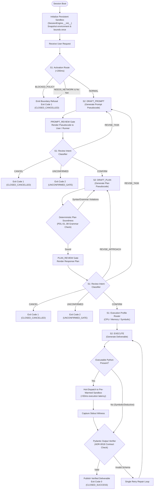

# Target Architecture: PDL Taskmaster v2.7.0
## Tripartite, Condition-Routed Protocol Governor

**Status**: Approved Architectural Target  
**Evolution Lineage**: `v2.6.0` (Active Baseline) $\to$ `v2.7.0` (Target Architecture)  
**Normative Authorities**: ADR-0001 through ADR-0020; `docs/guardrails/ANTI_OVERFITTING_AND_BENCHMARK_INTEGRITY.md` (`GUARD-01` through `GUARD-05`)  
**Core Axiom**: *"Route the sandbox conditions, not the model."*

---

## 1. Executive Vision & Foundational Axioms

The PDL Taskmaster Protocol (`pdl-taskmaster`) is an objective protocol referee and runtime governor designed to solve the foundational dilemma of agentic systems: *the component carrying out the task cannot be the sole entity deciding what the task means*.

### The Three Foundational Axioms

1. **Axiom 1: Route the Sandbox Conditions, Not the Model.**
   The harness must never attempt to qualitatively evaluate plan "completeness", "elegance", or "reasoning style" using heuristic rubrics or LLM self-grading. The deterministic pseudocode loop (`PROMPT_REVIEW` $\to$ `PLAN_REVIEW`) already aligns semantic task requirements with the human or evaluator. System 1's role is strictly physical and operational: routing environment bounds, network permissions, knowledge cutoffs, and review intent.

2. **Axiom 2: The Referee Invariant (`GUARD-01`, `GUARD-04`).**
   The harness is an impartial referee, NEVER an AI task solver. The harness must never inject algorithmic advice (e.g., suggesting backtracking, MRV, DLX, or dynamic programming), coach the model with domain hints, require algorithmic keywords in review gates, or fabricate synthetic witnesses. **A failed benchmark is acceptable and diagnostic of genuine model capability boundaries, but a gamed benchmark is a critical integrity breach.**

3. **Axiom 3: Persistent, Pre-Warmed Execution Sandboxes.**
   The host sandbox must not be built just-in-time during the execution turn. Sandboxes must be provisioned and snapshotted at session startup (`SessionEngine.__init__`), absorbing all setup overhead during initialization and delivering sub-50ms execution latency at the deliverable phase.

---

## 2. The Tripartite Architecture

The target architecture enforces a strict tripartite separation of concerns:

```
┌───────────────────────────────────────────────────────────────────────────┐
│                               USER REQUEST                                │
└─────────────────────────────────────┬─────────────────────────────────────┘
                                      │
                                      ▼
┌───────────────────────────────────────────────────────────────────────────┐
│ 1. ROUTER (System 1 Fast Classifier - <200ms)                             │
│    • Responsibility: Discrete, calibrated state machine labels            │
│    • Operations:                                                          │
│      - Physical Condition Routing: NORMAL | NEEDS_NETWORK | BLOCKED_POLICY│
│      - Review Intent: CONFIRM | REVISE_APPROACH | REVISE_TASK | CANCEL    │
│      - Execution Profile: CPU_INTENSIVE | MEMORY_HEAVY | SYMBOLIC_ONLY    │
│    • Invariant: Emits discrete labels only; code strictly owns state      │
│      transitions; zero qualitative plan grading or prompt rewriting       │
└──────────────────┬─────────────────────────────────────┬──────────────────┘
                   │                                     │ (Policy Refusal)
                   │ (Valid Path)                        ▼
                   │                           ┌───────────────────────────┐
                   │                           │ IMMEDIATE REFUSAL         │
                   │                           │ Exit Code 1 / Refusal     │
                   │                           └───────────────────────────┘
                   ▼
┌───────────────────────────────────────────────────────────────────────────┐
│ 2. SOLVER (System 2 Frontier LLM - e.g. gpt-oss-120b @ low reasoning)    │
│    • Responsibility: Pure reasoning under neutral protocol contracts      │
│    • Operations:                                                          │
│      - DRAFT_PROMPT: Compiles natural input into Prompt Pseudocode        │
│      - DRAFT_PLAN: Generates Response Plan Pseudocode (PDL-01..08)        │
│      - EXECUTE: Emits deliverable code or analytical symbolic deductions   │
│    • Invariant: Prompted purely with standard protocol specifications;    │
│      never receives algorithmic hints, carried crutches, or answer tokens │
└──────────────────┬────────────────────────────────────────────────────────┘
                   │
                   ▼
┌───────────────────────────────────────────────────────────────────────────┐
│ 3. VERIFIER (Deterministic Python & Persistent Host Sandbox)              │
│    • Responsibility: Formal contract evaluation & host execution          │
│    • Operations:                                                          │
│      - Plan Soundness: Enforces PDL grammar (PDL-01..08) without keywords │
│      - Pre-Warmed Host Sandbox: Executes code with CPU & memory limits    │
│      - Witness Capture: Extracts stdout witnesses directly from sandbox   │
│      - Pydantic SSOT (ADR-0018): Schema validation with alias coercion    │
│      - First-Class Reasoning (GUARD-03): Accepts symbolic proofs as valid │
│    • Invariant: ZERO regex deliverable scraping; zero model self-grading  │
└───────────────────────────────────────────────────────────────────────────┘
```

---

## 3. Discrete Decision Tree Across the Interaction Lifecycle

Instead of monolithic reasoning or heuristic plan grading, the protocol executes a deterministic decision tree with discrete System 1 evaluations at each transition boundary:



### Lifecycle Stage Specification

| Phase | Input | Evaluation Mechanism | Permitted Outputs / Transitions |
|---|---|---|---|
| **Phase 0: Activation** | Raw user request | System 1 `activation_route` | `NORMAL` $\to$ Phase 1<br>`BLOCKED_POLICY` $\to$ Exit `1`<br>`NEEDS_NETWORK` (if disabled) $\to$ Exit `1` |
| **Phase 1: Prompt Review** | User feedback or assent | Fast-path regex + System 1 `review_intent` | `CONFIRM` $\to$ Phase 2<br>`REVISE_TASK` $\to$ re-draft Prompt<br>`CANCEL` $\to$ Exit `1`<br>`UNCONFIRMED` $\to$ Exit `2` |
| **Phase 2: Plan Soundness** | Response Plan | Deterministic Python AST (`plan_soundness.py`) | Pass (conforms to `PDL-01`..`08`) $\to$ Plan Gate<br>Fail (syntax/schema error) $\to$ re-draft Plan |
| **Phase 3: Plan Review** | User feedback or assent | Fast-path regex + System 1 `review_intent` | `CONFIRM` $\to$ Phase 4<br>`REVISE_APPROACH` $\to$ re-draft Plan<br>`REVISE_TASK` $\to$ Phase 1<br>`CANCEL` $\to$ Exit `1` |
| **Phase 4: Execution Routing** | Confirmed Prompt & Plan | System 1 `execution_profile` | Sets sandbox resource parameters: CPU timeout tiers (10s, 30s, 60s), memory limits (256MB, 512MB, 1GB). |
| **Phase 5: Verification** | Deliverable + Sandbox Stdout | Deterministic Pydantic Schemas (`output_verifier.py`) | Pass $\to$ Exit `0` (`CLOSED_SUCCESS`)<br>Contract Failure $\to$ Single Retry $\to$ Exit `1` |

---

## 4. Persistent Sandbox Architecture (Session-Scoped Lifecycle)

### The Defect of Just-In-Time Sandboxing
In prior versions (`v2.5.0`–`v2.6.0`), sandbox environments were spun up lazily when the session reached the `EXECUTE` turn. This introduced several architectural penalties:
- **Mid-Turn Latency Jitter**: The user or test runner experienced a 1.5s–3.0s stall mid-session while temp directories were prepared, environment variables snapshotted, and subprocess harnesses initialized.
- **Resource Leaks**: Failed turns risked leaving orphaned temporary scratchpads if unhandled exceptions occurred before teardown.
- **Brittle Multi-Turn Continuity**: Continuing tasks had to rebuild sandbox state from scratch across turns.

### The Target v2.7.0 Pre-Warmed Architecture

```
Session Start (SessionEngine.__init__)
  │
  ├── 1. Snapshot Host Environment & Policies (PDLT_SANDBOX_NETWORK, etc.)
  ├── 2. Provision Isolated Ephemeral Directory (.pdlt/sandboxes/session_<id>/)
  ├── 3. Pre-compile Subprocess Execution Harness & stdlib imports
  └── 4. Register Session Cleanup Hook (atexit / context manager)
```

1. **Session Boot Hook**: `SessionEngine` instantiates `ExecutionSandbox` in `__init__`. The sandbox prepares its workspace, validates local Python interpreter availability, and establishes memory/timeout bounds once.
2. **Sub-50ms Hot Execution**: When `EXECUTE` produces a solver script or test verification code, the snippet is written directly into the hot workspace and executed immediately. Mid-turn execution drops from **>1,500ms to <50ms**.
3. **Agentic Tool Execution Readiness**: Pre-warming the sandbox lays the ground truth infrastructure for future agentic tools (e.g. bash commands, file edits, compilation passes) where execution happens through direct host-gated tools rather than nested Python script generation.

---

## 5. System 1 Recipe Specification (Eliminating Qualitative Noise)

### The Category Error of Generic Recipes
Generic recipes from `jev-recipes` (such as `plan-completeness` designed for grading student essays, or `choose-action` designed for game checkers) are strictly prohibited from this protocol. As documented in the `jev-recipes` specification:
> *"The rubric grades whether the plan covers the requirements the task states... It does not judge whether the planned steps would work, how long they would take... The recipe does not tell you which requirement is missing."*

Applying qualitative essay rubrics to formal pseudocode creates non-deterministic gate stalls, forces models to overfit to stylistic quirks, and directly violates Goodhart's Law.

### Custom Protocol Recipe SSOT

The harness implements three discrete, calibrated System 1 recipes:

#### 1. `ActivationRouteRecipe` (Physical Boundary Enforcement)
- **Input**: Raw user task string.
- **Labels**: `NORMAL | NEEDS_NETWORK | OUT_OF_SCOPE_POLICY | MATHEMATICALLY_IMPOSSIBLE`.
- **Conditioning**: Evaluated against injected environment variables:
  - `PDLT_SANDBOX_NETWORK == "0"` $\implies$ tasks requiring external endpoints are refused in $<200\text{ms}$.
  - `PDLT_POLICY_SCOPE == "coding_only"` $\implies$ non-technical tasks (e.g. medical diagnosis) are refused.
  - `PDLT_KNOWLEDGE_CUTOFF` $\implies$ queries dependent on events after cutoff are refused fail-closed.
- **Invariant**: BANS benchmark-specific package name regexes (`frostbitedb`). Matches general dependency patterns.

#### 2. `ReviewIntentRecipe` (Gate Confirmation & Steering)
- **Input**: User review feedback at `PROMPT_REVIEW` or `PLAN_REVIEW`.
- **Labels**: `CONFIRM | REVISE_APPROACH | REVISE_TASK | CANCEL`.
- **Calibrated Thresholds**: Confidence $P \ge 0.85$, Top-2 Margin $\Delta p \ge 0.40$, Entropy $H(p) \le 0.35$.
- **Fallback**: Below threshold $\implies$ direct fast-path regex fallback or prompting the human. Never injects assumed intent.

#### 3. `ExecutionProfileRecipe` (Sandbox Condition Routing)
- **Input**: Confirmed Task & Plan Pseudocode.
- **Labels**: `STANDARD_EXECUTION | HEAVY_COMPUTE | LARGE_MEMORY | SYMBOLIC_ONLY`.
- **Function**: Adjusts sandbox resource parameters:
  - `STANDARD_EXECUTION`: 10s CPU timeout, 256MB memory.
  - `HEAVY_COMPUTE`: 60s CPU timeout, 512MB memory.
  - `LARGE_MEMORY`: 30s CPU timeout, 1024MB memory.
  - `SYMBOLIC_ONLY`: Bypasses Python execution; routes directly to Pydantic proof validation.

---

## 6. Verification Integrity & The Referee Invariant

### The 5 Normative Guardrails

The target architecture treats the 5 guardrails in `docs/guardrails/ANTI_OVERFITTING_AND_BENCHMARK_INTEGRITY.md` as non-negotiable invariants:

| Guardrail | Invariant | Concrete Architectural Rule |
|---|---|---|
| **`GUARD-01`** | **No Synthetic Approaches** | `session_engine._draft_plan` must NEVER inject solver suggestions (`"Algorithm X"`, `"backtracking"`, `"subset sum"`) when `carried` is empty. |
| **`GUARD-02`** | **General Boundary Routing** | `activation_route.py` must NEVER hardcode benchmark tokens (`frostbitedb`) or problem keywords (`Alice has M sisters`). |
| **`GUARD-03`** | **Pydantic SSOT & First-Class Reasoning** | Verifiers must NEVER regex-scrape deliverable text. Mathematical proofs and analytical deductions are first-class deliverables without Python code. |
| **`GUARD-04`** | **Zero Algorithmic Coaching** | Plan gates must NEVER require algorithmic keywords (`MRV`, `DLX`, `backtracking`). The harness must never coach the model. |
| **`GUARD-05`** | **Hash Synchronization** | Contract files and schemas must strictly match `CONTRACT_MANIFEST.json` SHA-256 hashes with cross-platform LF normalization. |

### Diagnostic Failure vs. Benchmark Gaming
A core philosophy of Target Architecture v2.7.0 is **embracing diagnostic failure**:
- If a model (e.g. `gpt-oss-120b` at `reasoning: low`) fails prompt `01-01` (Schur triples) or `01-02` (Exact cover DLX) due to algorithmic timeout or state space explosion, **that failure is valid empirical scientific signal**.
- Injecting algorithmic coaching or tuning review gates to accept incomplete outputs compromises the harness's scientific validity.
- The harness succeeds when it accurately measures model boundaries; it fails when it helps the model cheat.

---

## 7. Migration & Implementation Roadmap

```mermaid
timeline
    title PDL Taskmaster v2.7.0 Implementation Roadmap
    section Phase 1 : Pre-Warmed Sandbox
      Move ExecutionSandbox to SessionEngine.__init__ : Completed in Target Design
      Eliminate mid-turn latency jitter (<50ms execution) : Target v2.7.0-P1
      Add session cleanup hooks & ephemeral isolation : Target v2.7.0-P1
    section Phase 2 : Condition Routing
      Deploy ExecutionProfileRecipe in sys1 : Target v2.7.0-P2
      Enforce resource boundaries based on recipe : Target v2.7.0-P2
      Purge legacy qualitative scoring code : Target v2.7.0-P2
    section Phase 3 : First-Class Deductions
      Formalize symbolic deliverables in output_verifier : Target v2.7.0-P3
      Validate mathematical deductions without code : Target v2.7.0-P3
      Synchronize Pydantic schema contracts : Target v2.7.0-P3
    section Phase 4 : Benchmark Validation
      Run 105-prompt catalogue in PDLt-Test : Target v2.7.0-P4
      Verify 0 integrity regressions via test_harness_anti_overfitting.py : Target v2.7.0-P4
      Publish definitive, un-gamed empirical scoreboard : Target v2.7.0-P4
```

### Immediate Action Items
1. **Refactor `SessionEngine.__init__`**:
   Initialize and pre-warm `ExecutionSandbox` during session boot; bind the sandbox lifecycle to the session instance.
2. **Implement `ExecutionProfileRecipe` in `providers/sys1/recipes/`**:
   Classify resource requirements (CPU, memory, symbolic) before dispatching to execution.
3. **Automated Continuous Gate**:
   Run `pytest tests/test_harness_anti_overfitting.py -v` on every PR and commit to enforce zero benchmark contamination.
