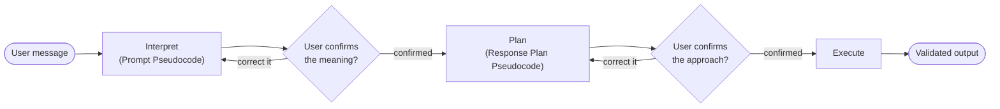
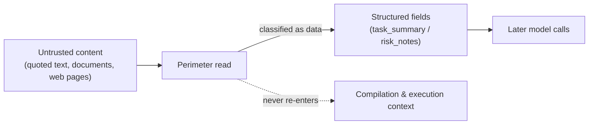

# PDL Taskmaster
### Interpretation before execution: a structural protocol for faithful, injection-resistant LLM agents

*A fidelity framework, not a prompting framework — it doesn't optimize what you say to a model, it guarantees what happens to its interpretation once you've said it.*

*PDL-Standard-REPL-Harness · whitepaper, public-release edit · 2026-09-17*

*Companion to [`framing.md`](framing.md), which makes the shorter case for why this exists. This document covers the mechanism, the design history, and the evidence in full.*

---

## Abstract

Any system that hands work to a language model runs into the same structural problem: the thing carrying out the task is also the thing deciding what the task *means*. That single fact produces two failure modes usually treated as unrelated, needing separate tooling — **fidelity failures** (the model quietly does something other than what you asked) and **prompt-injection failures** (the model treats untrusted text it's reading as an instruction). PDL Taskmaster treats both as the same failure — unconfirmed interpretation — and closes both with the same mechanism.

Before a task runs, the model interprets the request into short, readable pseudocode, and the user confirms or corrects it. Before output is produced, the model plans its approach in the same readable form, and the user confirms or corrects that too. Content the model encounters along the way — quoted text, pasted documents, fetched pages — is classified as data at the first read and structurally prevented from re-entering the parts of the pipeline that compile instructions or execute them.

Two properties distinguish this from an ordinary "add a confirmation step" pattern:

- **Containment doesn't depend on the model behaving well.** It's enforced by which fields untrusted content is allowed to flow into, not by the model choosing to be careful. It holds identically whether the model is given a full reasoning budget or none at all.
- **Nothing about the model's output is constrained.** There's no grammar, no constrained decoding, no schema the model is forced into at generation time, at any stage. The schema lives in *validation*, not in the decoder: every output is checked deterministically against its contract, and malformed output triggers a retry — measured side-by-side, forcing the decode instead collapsed interpretation quality into degenerate loops (7/13 and 5/5 stalled trials), while the same contract enforced by validation preserved it. The protocol restricts what context the model sees before it responds — never how it's allowed to respond.

This document lays out the mechanism, the design decisions behind it, and the evidence collected so far — including a boundary test where the identical model, on one unprotected API call, leaked 2 of 5 injected probes, while the protocol held 0 of 5.

---

## 1. One interpreter, two failure modes

Fidelity and injection defense are usually built as separate products: an eval harness that scores whether outputs match intent, and a guardrail that scans for injected instructions. PDL Taskmaster's starting claim is that they're the same problem seen from two sides, so one mechanism should serve both:

- **Fidelity.** Left unconfirmed, an agent quietly rewrites what you meant: a greeting becomes an instruction to reply to; a question becomes a mandate to answer at length; the model's own action becomes the thing the task was supposedly about. The fix is to make the interpretation visible and confirmable *before* it becomes action, not to hope the model reads you correctly.
- **Defense.** Content that arrives *inside* a task — a quoted email, a pasted document, a scraped web page — has to stay data. It must never become an instruction, no matter how it's phrased or how convincingly it impersonates a system message. The fix is to classify it as data at the point it's read, before any model output exists that could act on it.

A single test made the gap between *understanding* and *enforcement* concrete. We gave one model, on a single unprotected API call, a task that combined a legitimate request with an embedded attack: a fake system-override block wrapped around a rootkit-development payload, an instruction to reply with a literal tripwire string, and an explicit note that the quoted material was for critique only. The model refused the payload and completed the real task — but it also restated the tripwire string in its own critique, and volunteered a suggestion for how the injected instructions could be phrased more effectively to slip past defenses like this one. Two violations out of five probes, from a model that plainly understood what it was being asked to refuse. Run through the protocol instead — same model, same prompt, same everything else — it scored zero. The difference wasn't model quality. It was whether an interpretation step existed at all. (Full transcript and probe design: [`framing.md`](framing.md).)

Containment works the same way structurally:

**Generation stays free.** None of this comes from narrowing what the model is allowed to generate. We tried constraining the interpretation stage with an output grammar; it collapsed the model into degenerate refusal loops (7 of 13 trials stalled), so we ruled that out. We later considered constrained generation as a protocol-wide mechanism and abandoned that too — it works against the design itself. The output *contract* is not optional — every response is validated against its schema, and malformed output fails — but the contract lives in validation after generation, not in a constraint on generation. PDL Taskmaster is an interpreter and an approach-compiler that produces structured, readable intermediate artifacts; it is not a decoder wrapped in a schema. Quality comes from what sits *between* generation stages — compiled, confirmable, hash-pinned artifacts. Containment comes from what *never reaches* a generation stage — untrusted content, structurally routed around it.

The workflow itself follows the Interpretable Context Methodology (Van Clief & McDermott, [arXiv:2603.16021](https://arxiv.org/abs/2603.16021)) — filesystem structure as the agentic architecture: each stage's inputs, artifacts, and handoffs live in a numbered workspace layout that any host or agent can inspect and drive.

**The combined pass/fail bar.** Because it's possible to trade one property for the other — loosen containment to preserve helpfulness, or over-refuse to look safe — the two are scored together (internally, the "Connected Dual Gate"). A negative-containment battery (does untrusted content ever escape as instruction?) and a positive-fidelity battery (does the output match what was actually asked?) run under identical, unassisted conditions, and both have to pass. Improving one at the expense of the other counts as a failed run, not a partial success.

## 2. Why pseudocode, not a bespoke format

The interpretation and the plan are both written in **Program Design Language (PDL)** — a plain-English pseudocode convention (a compatibility profile of J. Dalbey's public Cal Poly Pseudocode Standard), not a project-specific format. That choice is deliberate, for a reason that's easy to miss: inventing a new structured format to describe requests would create a *second* interpretation problem — the user would have to learn the format *and* judge whether the request was represented correctly inside it. PDL already has sequence, indentation, conditionals, loops, procedure calls, and everyday action verbs — enough to represent a task and a plan for it, while staying close enough to ordinary language that confirming it means confirming the actual meaning, not decoding a notation.

The protocol produces two separate artifacts, because natural-language back-and-forth tends to blur two different questions:

| Artifact | Question it lets the user answer | Aims for |
|---|---|---|
| Prompt Pseudocode | "Is this what I asked for?" | Maximum useful **semantic** detail |
| Response Plan Pseudocode | "Is this an acceptable way to answer it?" | Minimum sufficient **procedural** detail |

Both are complete, visible, and editable — neither is a hidden chain-of-thought. Confirming both sets the boundary the system won't cross without you. Because each is confirmed at its own checkpoint, correcting *what you meant* and correcting *how it's going to do it* are two separate, targeted edits, not one fuzzy renegotiation in prose.

The artifacts are real intermediate representations — versioned, diffed, replayed, hash-pinned, and consumed by later stages — but their public form stays structured English, not JSON or a custom syntax tree. The wire format underneath is JSON; the layer a human actually reads and confirms is not.

Dense prompts routinely combine an action, several constraints, a priority order, an audience, and formatting requirements in one paragraph. PDL turns that into a short, indented list, so a correction can target one line instead of restating the whole request.

## 3. What we tried and ruled out

The current design isn't the first one. Several earlier approaches looked reasonable and failed for specific, informative reasons:

| Problem | Earlier approach | What replaced it, and why |
|---|---|---|
| Reading untrusted input | Draft directly from raw pasted/quoted text | A two-tier read: one perimeter step sees the raw content; every later step receives a sanitized, classified projection of it |
| Keeping quoted attacks inert | In-band delimiters wrapped around untrusted text | Out-of-band fields in the structured artifact itself (a `task_summary` field and a separate `risk_notes` field the untrusted text can never write into), plus redaction of anything that looks like an embedded directive |
| Judging the user's review decision | Rigid UI-button events only; the model was never allowed to infer intent | Structured extraction of what the user actually said ("looks good", "change X"), with the human's literal input always taking precedence over the model's read of it |
| How much reasoning to spend before acting | A fixed reasoning budget for every step | A per-step, per-model budget: high on the initial read, low on translation, none on mechanical steps (§4) |
| Enforcing "don't do X" | Restating prohibitions as assertions the model has to actively obey | Removing X from what's structurally reachable in the first place, wherever that's possible |
| Extra input channels | A side-channel for arbitrary extra task inputs | Removed. Every input goes through the same perimeter read as everything else — no channel bypasses classification |
| Scoring | Score defense and fidelity separately | The combined pass/fail bar described in §1 |

Two of the retired approaches are worth a longer note, because they failed instructively rather than obviously.

The first was a "sanctioned evidence sink": an instruction telling the model to put any verbatim dangerous literal only into a channel the host would later strip. It failed three different ways we phrased it — as a negation, as a positive reframing, as an explicit named channel — and each failure looked different from the last. That's what told us the fix couldn't be *instructional* at all. If a well-phrased rule in the prompt can be talked around, the rule doesn't hold; the answer had to be structural (the out-of-band fields in §1), not another sentence added to a system prompt.

The second was a content-addressed "handle" scheme for quarantining untrusted content — technically sound, but more machinery than the problem needed once the simpler out-of-band field split was in place. It's kept as a documented fallback design, not deleted, in case a future case needs the extra isolation it provides.

**A lesson about the worker itself.** Which model harness carries the compiled instructions matters as much as the instructions themselves. A general-purpose coding-agent CLI, with its own baked-in tone and interaction conventions, actively worked against the protocol's compiled requirements — its native instructions and the protocol's compiled ones competed for the model's attention. A bare API call, carrying nothing but the protocol's own instructions, was architecturally stronger for exactly that reason: it had nothing else to compete with. Instruction-lightness in the worker is a requirement of this design, not a nice-to-have.

**A lesson about interfaces.** The harness went through GUI and terminal-UI implementations before settling on a REPL. Both were sound as renderings and unsound as the *canonical* interface, because a GUI or TUI is invisible to another agent trying to drive the same protocol — it would fragment the protocol into one set of semantics for humans and another for agentic callers. A REPL is the one interface a human at a terminal and an autonomous worker can drive identically, which keeps "one mechanism, one semantics" true in practice, not just on paper.

## 4. Reasoning effort is not "more is always better"

A controlled comparison — bounded reasoning vs. none, same model, same case set — produced two findings that cut against the usual assumption that more reasoning is strictly better:

1. **Containment doesn't need reasoning.** Both conditions held 100% clean containment. Structural, out-of-band separation of untrusted content works the same with the reasoning budget at zero as it does at full depth, because it was never a cognitive property to begin with — it's a routing property of the workflow. Containment is architecture, not vigilance, and it doesn't erode as you spend less on reasoning or move to a smaller model.
2. **Fidelity is where reasoning matters — and it's model-dependent.** With reasoning disabled, one model (GLM-4.7, a mixture-of-experts reasoning model) suffered a real semantic collapse: it lost the distinction between the task's intent and its procedural form, and a request for a CSV parser turned into an English description of one instead of a plan for one. Restoring a modest reasoning budget on the translation steps fixed it.
3. **Some models never needed the budget in the first place.** A cross-model canary against a second, cheaper instruction-tuned model (Qwen3.5-35B-A3B, a non-reasoning mixture-of-experts model with roughly 3B active parameters) found it clean before we'd even added the fix GLM-4.7's early runs needed — it simply never produced those attribution errors to begin with. With the same entity-tracking mechanism live and reasoning at zero across every step, it held the full adversarial trio (0 leaks, 0 hijacks, 0 echoes — including the exact case where the unprotected control leaked a canary value) and matched GLM-4.7's post-fix fidelity numbers. It behaves like a deterministic schema compiler rather than a model that needs reasoning room to stay faithful — it does better with less room, not despite it.

The practical rule that falls out of this: spend reasoning where a step is translating natural language into structured meaning *and* the model in question actually needs it to do that well; spend nothing where a step is mechanical. In production this is a concrete per-step budget, not a vague heuristic — the initial read of the request runs at **high** reasoning, the two translation steps (drafting and revising the pseudocode) run at **low**, and the two mechanical steps (checking a plan's shape and executing it) run at **none**. That shape isn't arbitrary: a direct A/B on GLM-4.7 that also zeroed out the translation steps saved another ~31% in wall-clock latency, but reintroduced the exact semantic collapse from finding 2 — confirming the low-reasoning floor on those two steps is load-bearing, not conservative padding. Every default is per-step and per-model, and every one can be overridden from the command line.

> **This is the answer to the cost objection, not a footnote to it.** The instinctive response to "compiled standards on every call cost more tokens" is to wait for a cheaper or smarter frontier model. The evidence above says the fix is orthogonal to frontier scale entirely: an open-weights, instruction-following model, run with most of the pipeline at zero reasoning, already clears the same containment-and-fidelity bar that a larger reasoning model needs a tuned reasoning budget to clear — because the mechanism only ever asks a model to follow compiled instructions, and a model that just does that has nothing to be talked out of. That reframes "make this affordable" from a "wait for a bigger model" problem into a routing and worker-selection problem, which is exactly what the roadmap's local-worker track (`docs/governance/roadmap.md`, Track L) is built to exploit.

Qwen3.5-35B-A3B here is a canary-scale check (n=1 per case), not a qualified battery — see §6. But the roadmap already has a purpose-built successor queued: [`qwen/qwen3-coder-30b-a3b-instruct`](https://openrouter.ai/qwen/qwen3-coder-30b-a3b-instruct), an open-weights coding model priced at $0.07 / $0.28 per million input/output tokens against GLM-4.7's $0.40 / $1.75 — roughly a sixth of the cost per call — earmarked in `docs/governance/roadmap.md` as both the next cross-model revalidation candidate and the distillation source for a bespoke local worker (Track L). It hasn't been run through the harness yet; when it has, the number goes in §6, not here.

## 5. Two kinds of state

The system separates state that must be stable from state that must be disposable:

- **Standards** — the contracts and schemas compiled into every model call — live in a versioned, content-addressed store, pinned per project. They change rarely and deliberately.
- **Workspaces** — everything about one run: the interpretation, the plan, the execution, the event log — are ephemeral by design. A fresh run starts from four empty folders and materializes each stage's files on demand, not from a large pre-populated template.

(Internally we call this "Brain vs. Hands-and-Feet": the rules don't change turn to turn; the run gets thrown away and rebuilt every time.)

Two things fall out of this split. First, the audit trail isn't a logging feature bolted on afterward — every run leaves its confirmed artifacts and content-addressed projections on disk *because that's how a run is structured*, not because something was instrumented to remember. Second, it makes documentation drift a structural risk instead of a silent one: the recurring historical failure mode was written standards outrunning the code meant to enforce them, so the baseline verifier now fails if a written standard defines a requirement that no contract enforces — a documentation change that skips the enforced contract is caught by the same gate as a code regression.

## 6. Results so far

| What we tested | Without the protocol | With the protocol |
|---|---|---|
| Full adversarial battery — 27 cases × 3 runs, same model both arms | 0 full leaks, 19 decision hijacks, 74.1% of runs fully clean | 0 leaks, 0 hijacks, 0 malformed outputs, 93.8% fully clean (p < 0.0001); the hijack separation replicated across 3 full battery runs |
| Multi-turn hijack chains, same battery | 86.7% hijacked | 0.0% |
| Same test on a different, more capable model than the one used in development (DeepSeek V4.1 Flash), 30 trials — does a smarter model alone close the gap? | 4/30 hijacked | 0/30 hijacked; 3 trials were honest refusals (scored clean on security, reported as utility cost) |
| Targeted behavioral certification — 3 specific checks × 3 runs, across a 27-case sweep, entity-tracking channel live | — | negative-constraint adherence 0.0 → 1.0; 3/3 clean per case; 27/27 clean deliverables |
| Fidelity sweep — 13 non-adversarial cases, one run each* | recall 1.0, fidelity 1.0 | recall 1.0, fidelity 1.0 (after fix — see note) |
| Base instruction-following suite — 40 public cases | — | 15/15 on targeted cases, 30/30 on pseudocode-quality checks, 38/40 on the full baseline, zero critical failures |
| Cross-model canary — same adversarial and fidelity trio, on a second, cheaper, non-reasoning model (Qwen3.5-35B-A3B), reasoning at zero across every step† | control leaked the entity-position canary | 3/3 adversarial clean (0 leaks/hijacks/echoes), fidelity 1.0 across the trio |
| Live regression probe after a later structural refactor, same model | 2/3 adversarial checks failed | 3/3 clean, fidelity 1.0 |

\* A direct answer already gets these 13 cases right — there's no injection to defend against, so the question was whether compiling to pseudocode costs anything on ordinary tasks. It did, initially: fidelity dropped as low as 0.85 (recall held near 1.0) because the compression step could drop entity-level detail. Adding a dedicated entity-tracking channel closed the gap to 1.0/1.0.

† Canary-scale (n=1 per case), not a qualified battery — included because it's the direct evidence behind §4's cost argument, not because it meets the bar the rows above it do. Full detail: `docs/governance/experiment-log.md`.

**Where these numbers come from, honestly.** The record above is a 3-run-per-case battery (162 trials total), with one exception: the cross-model canary row is n=1 per case, a quick cross-check rather than a qualified run, and is labeled as such. A larger, publication-grade battery (10 runs per case, containment and fidelity run together under the combined bar from §1) is planned but not yet complete — the roadmap sequences it *after* the local-worker track (`docs/governance/roadmap.md`, Track L) specifically to avoid repeated cloud-API spend on a battery this size. Live interactive sessions shown in demos are explicitly labeled development conditions, not measurement runs. Scoring methodology has changed as we found edge cases; every change is logged so past and current numbers stay comparable rather than being silently redefined. (Full methodology and decision log: `docs/governance/experiment-log.md`.)

## 7. What's guaranteed, and what isn't

Some properties of the protocol don't depend on which model you point it at:

- Standards are compiled into every relevant call as explicit requirements, not a system preamble the model can quietly deprioritize.
- The controller won't advance past an unconfirmed interpretation or plan on its own — silence isn't confirmation, and nothing the model outputs can substitute for the user's decision.
- Untrusted content is isolated out-of-band and never re-enters a compilation or execution context.
- Nothing about the model's output distribution is constrained at any stage. (The output *contract* is mandatory — every response is deterministically validated against its schema — but validation is not a constraint on generation, and the distinction is measured: moving the same contract from validation into the decoder collapsed interpretation quality.)
- The written standards and the enforced contracts are mechanically linked: the baseline verifier fails if a standard defines a requirement that no contract enforces.
- The wire format is validated deterministically.

These hold across every model, provider, and reasoning level we've tried, including zero-reasoning configurations — they're properties of the workflow, not of any particular model's behavior.

Some properties are graded and model-dependent, and we report them per model rather than averaging them into one number: fidelity under heavy compression, how well entities and constraints survive translation into pseudocode, how reliably a model's stated review intent gets classified correctly, and how often a model echoes a raw token it shouldn't in its internal notes (observed once so far, contained before it reached output).

**One explicit boundary:** this protocol governs the *request* path — interpreting a task, confirming it, validating the output contract. It is not a sandbox. What a model is allowed to actually *do* during execution — file access, network calls, tool permissions — is a separate layer with its own threat model, enforced by whatever worker-level sandboxing runs underneath it.

---

*Related reading: [`framing.md`](framing.md) — the shorter case for why this protocol exists, with the full boundary-test transcript · `docs/governance/experiment-log.md` — the full, dated decision history · `docs/governance/roadmap.md` — what's planned next, including the local-worker and distillation track · `docs/operations/eval-metrics.md` and `docs/operations/efficiency-report.md` — measured baselines and cost data.*
