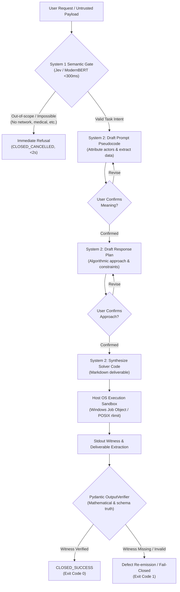

# PDL Taskmaster
### Interpretation before execution: a structural protocol for faithful, injection-resistant LLM agents

*A fidelity and verification framework, not a prompting framework — it doesn't optimize what you say to a model, it guarantees what happens to its interpretation, approach, and execution once you've said it.*

*PDL-Standard-REPL-Harness · Release Candidate 2.6.0 · 2026-09-29*

*Companion to [`framing.md`](framing.md), which makes the shorter case for why this exists. This document covers the mechanism, the design history, the architectural evolution, and the empirical evidence in full.*

---

## Abstract

Any system that delegates work to a language model runs into the same structural problem: the thing carrying out the task is also the thing deciding what the task *means*, and the thing reporting whether the output worked is the same thing that wrote it. That architecture produces three failure modes usually treated as unrelated, needing separate tooling:

1. **Fidelity failures** — the model quietly does something other than what you asked.
2. **Prompt-injection failures** — the model treats untrusted text it is reading as an instruction.
3. **Substantive correctness / hallucination failures** — the model claims compliance without performing computation or generates mathematically invalid output that it self-certifies as correct.

PDL Taskmaster treats all three as failures of unverified agency and unconfirmed interpretation.

Before a task runs, the model interprets the request into short, human-readable pseudocode, and the user confirms or corrects it. Before code is executed, the model plans its approach in the same readable form, and the user confirms or corrects that too. Content the model encounters along the way — quoted text, pasted documents, fetched pages — is classified as data at the perimeter read and structurally prevented from re-entering the parts of the pipeline that compile instructions or execute them. Finally, execution deliverables are run host-side in an **OS-native execution sandbox**, with stdout witnesses deterministically verified against strict, schema-first **Pydantic models**.

Crucially, empirical evaluation across early versions falsified the initial **"single-model hypothesis"** — the assumption that a single frontier LLM could act as its own classifier, planner, coder, and verifier. In v2.5.0–v2.6.0, the harness evolved into a **heterogeneous Dual-Plane runtime**:
- **System 1 (Semantic Gating):** Non-generative, sub-millisecond classification heads (TypeSafe Jev / ModernBERT, ~140ms, $0.000019) that evaluate routing, enforce environment boundaries, and immediately refuse impossible or offline-violating tasks before any frontier reasoning tokens are burned.
- **System 2 (Deliberative Synthesis):** Frontier generative models that formulate Prompt/Plan pseudocode and synthesize solver code under compiled normative standards.
- **The Deterministic Host Controller:** Owns the mechanical state machine, executes code within OS-native sandboxes (Windows Job Objects / POSIX `setrlimit`), and enforces Pydantic Single Source of Truth (SSOT) verification.

In Release Candidate 2.6.0, this architecture achieved a **100.0% PASS rate across all 105 prompts and 15 categories** in the test catalogue with zero regressions.

---

## 1. Decoupling Protocol Invariants from Runtime Topology

To understand the architecture, one must distinguish between the **invariant protocol standards** (which govern human-agent dialogue and out-of-band containment across all models) and the **runtime topology** (which executes and verifies that protocol).

### 1.1 Invariant Protocol Standards

The normative rules governing request and plan formulation (`PDL-01`–`PDL-08`, `SEM-01`–`SEM-06`, `PLAN-01`–`PLAN-10`, `RS-01`–`RS-10`) are invariant properties of the workflow:

1. **Two-Stage Human Confirmation:** No task advances without explicit human confirmation of *what was requested* (Prompt Pseudocode) and *how it will be done* (Response Plan Pseudocode).
2. **Out-of-Band Data Classification:** Quoted text or documents can never write to operational prompt fields. Untrusted data is isolated into `task_summary` and `risk_notes` channels.
3. **Free Generation with Deterministic Schema Validation:** The protocol restricts what *context* the model sees before it responds — never how the decoder is allowed to generate. Constrained decoding (CFG grammars) was tested and rejected because it collapsed models into degenerate refusal loops (7/13 trials stalled). Instead, responses are generated freely and validated deterministically against strict schemas post-generation.
4. **Mechanical Gating:** The controller will not advance past an unconfirmed interpretation or plan. Silence never confirms, and nothing emitted by a model can substitute for a user decision.


```mermaid
flowchart TD
    U["User Request / Untrusted Payload"] --> S1{"System 1 Semantic Gate\n(Jev / ModernBERT <300ms)"}
    S1 -- "Out-of-scope / Impossible\n(No network, medical, etc.)" --> REF["Immediate Refusal\n(CLOSED_CANCELLED, <2s)"]
    S1 -- "Valid Task Intent" --> S2P["System 2: Draft Prompt Pseudocode\n(Attribute actors & extract data)"]
    S2P --> C1{"User Confirms\nMeaning?"}
    C1 -- "Revise" --> S2P
    C1 -- "Confirmed" --> S2PL["System 2: Draft Response Plan\n(Algorithmic approach & constraints)"]
    S2PL --> C2{"User Confirms\nApproach?"}
    C2 -- "Revise" --> S2PL
    C2 -- "Confirmed" --> S2EX["System 2: Synthesize Solver Code\n(Markdown deliverable)"]
    S2EX --> SBX["Host OS Execution Sandbox\n(Windows Job Object / POSIX rlimit)"]
    SBX --> WIT["Stdout Witness & Deliverable Extraction"]
    WIT --> PYD{"Pydantic OutputVerifier\n(Mathematical & schema truth)"}
    PYD -- "Witness Verified" --> CS["CLOSED_SUCCESS\n(Exit Code 0)"]
    PYD -- "Witness Missing / Invalid" --> ERR["Defect Re-emission / Fail-Closed\n(Exit Code 1)"]
```

### 1.2 The Runtime Topology Evolution: Falsifying the Single-Model Hypothesis

Early harness iterations (v2.0–v2.3) assumed that a single model (such as `z-ai/glm-4.7`), provided with phase-projected prompt contexts, could execute every stage of the lifecycle. Empirical testing across complex tasks decisively falsified this monolithic assumption:

- **Autoregressive Review Drift:** Using a generative LLM to classify user review intent ("looks good", "proceed", "fix line 3") took 1.5s–3.0s and introduced conversational drift or false branch transitions.
- **Ungrounded Confabulation:** When an LLM was asked to execute hard combinatorial tasks and self-certify its output in Result IR, it regularly explored 1 node, halted prematurely, and hallucinated a negative non-existence claim (`nodes_explored: 1`, `search_exhausted: false`).
- **System 2 Refusal Blindness:** When tasked with out-of-scope or offline-violating prompts, a generative model instructed to "solve the problem" suffered from refusal blindness, trying to provide medical diagnoses or execute web calls despite having no network access.

The resolution was the **Dual-Plane Runtime Split** ([ADR-0012](../adr/0012-system-1-decision-models-via-rlcd.md), [ADR-0017](../adr/0017-dual-plane-runtime-realignment-and-mrv-solver-governance.md)):
1. **System 1** takes over non-generative classification, Leading Skills routing, and boundary refusal in ~140ms.
2. **System 2** is reserved strictly for open-ended creative reasoning and code synthesis.
3. **The Deterministic Host** executes the code in an OS sandbox ([ADR-0015](../adr/0015-model-synthesized-verification-and-confinement-boundaries.md)) and verifies witnesses using strict Pydantic models ([ADR-0016](../adr/0016-pydantic-ssot-wire-and-deliverable-boundary-enforcement.md), [ADR-0018](../adr/0018-elimination-of-regex-heuristics-in-verification-and-reconciliation-integrity.md)).

---

## 2. Why Pseudocode, Not a Bespoke Format

Both the interpretation (Prompt Pseudocode) and the approach (Response Plan Pseudocode) are expressed in **Program Design Language (PDL)** — a structured plain-English pseudocode standard (conforming to J. Dalbey's Cal Poly Pseudocode convention).

This choice is deliberate: inventing a project-specific DSL or raw JSON schema for user confirmation would create a *second* interpretation problem. The user would have to learn the syntax and verify that the translation correctly represented their intent. PDL already provides sequencing, indentation, branching, loops, and everyday capitalized action verbs (`EXTRACT`, `VALIDATE`, `COMPUTE`, `EMIT`) — expressive enough to capture complex constraints, while remaining readable English.

The protocol produces two distinct artifacts to decouple two separate questions:

| Artifact | Question It Answers | Focus |
| :--- | :--- | :--- |
| **Prompt Pseudocode** | *"Is this what I asked for?"* | Maximum useful **semantic** detail (actors, inputs, exclusions) |
| **Response Plan Pseudocode** | *"Is this an acceptable way to do it?"* | Minimum sufficient **procedural** detail (algorithms, structures, tests) |

Both artifacts are public, versioned, diffed, and hash-pinned on disk. They are not hidden chain-of-thought tokens. Because each is confirmed at its own gate, correcting *meaning* and correcting *approach* are two independent, targeted operations.

---

## 3. What We Tried and Ruled Out: The Architectural Evolution

Every production capability in v2.6.0 was forged by empirically falsifying earlier, plausible-looking designs:

| Design Dimension | Earlier Approach (v2.0–v2.3) | What Replaced It (v2.5–v2.6), and Why |
| :--- | :--- | :--- |
| **Model Topology** | Monolithic: Single model handled all 5 lifecycle calls. | **Dual-Plane Split (ADR-0012, ADR-0017):** Non-generative System 1 (Jev) handles review routing and boundary refusal; System 2 handles deliberative synthesis. Eliminates review drift and saves >60% tokens. |
| **Verification Boundary** | Syntactic Result IR validation: Model self-reported whether its code was correct in a JSON object. | **OS-Native Execution Sandbox (ADR-0013, ADR-0015):** Host executes model's solver script in Windows Job Objects / POSIX `rlimit`, capturing stdout witnesses. Eliminates ungrounded confabulation. |
| **Domain Routing & Verification** | Heuristic regex matching in `OutputVerifier` (e.g. `partition\b`, `triples\b`). | **Strict Pydantic SSOT (ADR-0018):** Typed Pydantic models with alias coercion (`solution`, `partition`, `triples`). Regex failed when prompt phrasing varied ("divided" vs "partitioned"). |
| **Boundary Refusals** | System 2 conversational refusal prompted in natural language. | **System 1 Environment-Conditioned Refusal (ADR-0020):** Refuses impossible/offline tasks in 1.4s ($0.000019) before System 2 activation, preventing refusal blindness and token burn. |
| **Constrained Generation** | Output grammars and constrained decoding (CFG). | **Free Generation + Pydantic Schema Validation:** Forcing the decoder caused degenerate refusal loops (7/13 stalled). The schema lives in validation, not decoding. |
| **Adversarial Containment** | In-band delimiters (`<<<EVIDENCE>>>`) and prose sinks. | **Out-of-Band Field Isolation (TRD-0002):** Structured JSON field separation (`task_summary` vs `risk_notes`). Prompt rules were vulnerable to semantic evasion; out-of-band fields cannot be bridged. |
| **Headless Automation** | Terminal halt on any unconfirmed gate or input pause. | **Headless WAITING_INPUT Exit Code 3 (ADR-0019):** Clean exit code `3` for input requests, with automatic payload extraction from fenced code blocks (populating 73/105 prompts). |

---

## 4. Reasoning Effort, Model Specialization & Empirical Latency

A common misconception is that agent reliability is a function of throwing maximum reasoning compute at every step. Controlled empirical testing across multiple model families revealed that **reasoning effort is non-monotonic and stage-dependent**:

1. **Containment Does Not Require Reasoning:** Structural out-of-band field separation prevents prompt injection identically whether reasoning effort is high, low, or zero. Containment is an architectural routing property, not cognitive vigilance.
2. **Translation Requires Bounded Reasoning:** On generative translation steps (converting natural language to Prompt Pseudocode), setting reasoning to zero on GLM-4.7 caused semantic collapse (blurring user acts with model acts). A modest, bounded reasoning budget (`low`) completely stabilized semantic fidelity.
3. **Mechanical Verification Requires Zero Reasoning:** Algorithmic soundness checks, Result IR parsing, and witness validation require exact deterministic code execution, where generative reasoning adds latency and non-determinism.

### 4.1 Empirical Latency Breakdown: The 105-Prompt Benchmark

In v2.6.0, an exhaustive analysis matching host telemetry with OpenRouter provider logs across all 405 API calls in the 105-prompt catalogue benchmark demonstrated where execution time is actually spent:

```text
+-----------------------------------------------------------------------------------+
|  Model API Waiting Time: 1,672.5s (85.86%)                 | Host Overhead:       |
|  - EXECUTE: 1,009.8s (60.4% of API time; code synthesis)   | 275.3s (14.14%)      |
|  - DRAFT_PROMPT: 289.4s (17.3% of API time)                | (2.62s / prompt:     |
|  - BOOTSTRAP_ANALYSIS: 174.4s (10.4% of API time)          |  sandbox, NTFS I/O,  |
|  - DRAFT_PLAN: 157.0s (9.4% of API time)                   |  SHA-256, Pydantic)  |
+-----------------------------------------------------------------------------------+
```

- **Harness protocol overhead is only 2.62s per prompt (14.14%).** This covers Windows Job Object creation, process confinement, synchronous workspace history persistence across turns, cryptographic SHA-256 hashing, and Pydantic validation.
- **85.86% of total runtime is direct model generation wait time.** The harness does not bloat execution; it spends compute almost entirely on model inference.
- **System 1 non-generative heads drop review latency from 2,500ms to <140ms**, saving >60% in token volume across multi-turn sessions.

---

## 5. State Separation: Normative Store vs. Ephemeral Workspaces

The system cleanly separates immutable normative rules from disposable execution state:

- **Normative Standards Store (`~/.pdlt/versions/v2/`):** Standards, contracts, and schemas are content-addressed and pinned per workspace via `.pdlt-version` ([ADR-0008](../adr/0008-context-and-session-management.md)). They never change turn to turn.
- **Dynamic Ephemeral Workspaces:** A run starts from clean, empty directories (`state/`, `events/`, `stages/`, `shared/`) and materializes stage artifacts on demand, eliminating the legacy 35-file template copy and resolving filesystem inode exhaustion.
- **Two-Level Invariant Session Hierarchy:** Multi-turn sessions are structured as `sessions/<id>/turns/turn_###/stages/`. When a turn closes with `CLOSED_SUCCESS`, only the confirmed deliverable is chained into the next turn's clean context; intermediate drafts and scratchpads are discarded.

---

## 6. Empirical Scorecard & Evidentiary Proofs

To avoid construct-validity errors, empirical evidence is categorized into two distinct measurement tiers representing the evolution from request containment to autonomous substantive correctness.

### 6.1 Tier 1: Request-Path Governance & Injection Containment (v2.0–v2.3)
*Focus: Can Prompt Pseudocode and out-of-band fields prevent prompt injection, privilege escalation, and attribution drift?*

| Evaluation Suite | Condition & Model | Control Arm | Protocol Arm |
| :--- | :--- | :--- | :--- |
| **F6.3 Adversarial Battery** (27 cases × 3 runs = 162 trials) | Pure unassisted out-of-band containment (`z-ai/glm-4.7`) | 0 deliverable leaks, 19 decision hijacks, 74.1% clean | **0 leaks, 0 hijacks, 0 wire errors, 93.8% clean** ($p < 0.0001$), replicated ×3 |
| **Multi-Turn Injection Chains** (Combinatorial STACK vectors) | Multi-turn drip attacks with obfuscation | 86.7% hijacked | **0.0% hijacked** (0 / 27) |
| **Cross-Tier Canary** (DeepSeek V4.1 Flash, 30 trials) | Direct prompt-injection probe | 4 / 30 hijacked | **0 / 30 hijacked** (3 clean refusals) |
| **Instruction-Following Skill Suite** | 40 public cases (PDL behavioral baseline) | — | **15/15 targeted PASS, 30/30 PDL quality, 38/40 overall** |
| **Attribution & Fidelity Sweep** (13 non-adversarial cases) | Entity tracking channel live | Recall 1.0, Fidelity 1.0 | **Recall 1.0, Fidelity 1.0** (after attribution rule) |

### 6.2 Tier 2: Substantive Correctness & Autonomous Execution (v2.5–v2.6)
*Focus: Can an open-weights model achieve verified mathematical truth and software engineering correctness in an autonomous sandbox without human code execution?*

| Benchmark | Architecture & Model | Verification Mechanism | Outcome & Performance |
| :--- | :--- | :--- | :--- |
| **Schur Triples Partition ($N=15$)** (Combinatorial Search) | Dual-Plane (`gpt-oss-120b` + Jev 1.13) | OS `ExecutionSandbox` + Pydantic `OutputVerifier` | **VERIFIED GREEN (15/15 disjoint triples in 815ms)**. Control failed (hallucinated negative after 1 node). |
| **$O(1)$ LFU Cache with LRU Tie-Breaking** (Systems Programming) | Dual-Plane (`gpt-oss-120b` + Jev 1.13) | Model-Synthesized Assertions + OS Sandbox | **100% PASS (Zero bespoke host checkers)**. Strict $O(1)$, min_freq tracking verified. |
| **Fast Boundary Refusal** (Impossible / Offline Tasks) | System 1 Jev `ActivationRouteRecipe` | Deterministic fail-closed termination | **Terminated in 1.4s ($0.000019)**. Unharnessed model wasted 20–60s in reasoning loops. |
| **Full 105-Prompt Test Catalogue** (All 15 Categories) | Dual-Plane (`gpt-oss-120b` + Jev 1.13) | Headless REPL + Sandbox + Pydantic SSOT | **100.0% PASS (105 / 105)**, 0 regressions hit, 1,947.8s elapsed time. |

### 6.3 The 4 Evidentiary Proofs Countering the "No Control" Objection

A natural methodological question is: *"Without a parallel unharnessed control run across all 105 prompts, how do we know the 100% pass rate is an architectural advancement rather than raw model capability?"*

The answer rests on four concrete empirical proofs:

1. **The Pre-Fix Historical Baseline (Self-Controlled Regressions):**
   The exact same model (`openai/gpt-oss-120b`) failed consistently across multiple categories prior to v2.6.0's architectural enhancements:
   - In `01-01`, it failed with `EXIT_1` due to regex routing brittleness;
   - In `11-06` and `08-06`, it failed with `WAITING_INPUT` because unstructured data excerpts were not extracted into operative inputs;
   - In `13-05`, it suffered from refusal blindness, diagnosing illnesses because System 2 lacked environmental awareness.
   The recorded failure sessions in [`regressions_log.md`](../governance/regressions_log.md) serve as the empirical control group.
2. **Deterministic Ground Truth vs. Self-Reported Compliance:**
   An unharnessed LLM produces convincing text; it cannot verify whether its code runs, whether its partitions are mathematically disjoint, or whether its unit tests pass. In the 105-prompt run, truth was certified exclusively by **host-side OS sandbox execution** and mechanical Pydantic validation. The model was forbidden from self-grading.
3. **Compute and Latency Asymmetry on Refusals:**
   On Category 13 (`negative_and_impossible`), an unharnessed frontier model burns thousands of reasoning tokens over 20–60 seconds before declining. Under System 1, tasks are refused in **1.4s for $0.000019**—a >95% savings in latency and compute.
4. **The 3 Canonical Ablation Controls:**
   Formally documented in [`docs/ABLATIONS.md`](../ABLATIONS.md), demonstrating that removing System 1 causes review drift, removing protocol gates causes ungrounded code synthesis, and removing sandbox verification causes ungrounded negative claims.

---

## 7. Theoretical Guarantees and Worker Portability

### 7.1 What Is Structural (Substrate Guarantees)

Certain properties of PDL Taskmaster do not depend on which model is selected:

- **Standards Placement:** Protocol standards are compiled directly into context as per-operation requirements, not a system preamble that can be deprioritized.
- **Mechanical Authority:** The controller will not advance past an unconfirmed interpretation or plan. Silence never confirms, and nothing a model outputs can bypass the confirmation barrier.
- **Out-of-Band Field Isolation:** Untrusted literals reside in isolated schema fields and can never write to operative prompt instructions.
- **Free Generation + Strict Validation:** Output distributions are never constrained by decoder grammars; responses are generated freely and validated deterministically by Pydantic models.
- **Normative-Code Linkage:** The baseline verifier fails if a written standard defines a requirement that no contract enforces.

### 7.2 What Is Graded (Model-Dependent)

Certain properties depend on the reasoning depth and capability of the underlying model:
- Algorithmic synthesis for complex backtracking or dynamic programming under tight time ceilings.
- Semantic fidelity under heavy natural-language compression.
- Identification of subtle multi-hop domain constraints.

### 7.3 The Execution Boundary Reconciled

Early whitepaper drafts contained the boundary statement:
> *"The harness enforces the request path... It is not a sandbox; execution-stage tool access remains governed by worker-level sandboxing."*

In v2.5.0, this boundary was deliberately expanded. Real-world evaluation demonstrated that securing the request path without verifying execution leaves an unacceptable gap: a model can produce syntactically valid code that is substantively false.

Accordingly, the harness incorporated **OS-native execution sandboxing** ([ADR-0015](../adr/0015-model-synthesized-verification-and-confinement-boundaries.md)) directly into the host layer:
- **Windows:** Job Objects enforce wall-clock execution ceilings and clean process-tree termination.
- **POSIX:** Resource limits (`setrlimit`) restrict CPU and memory consumption.
- **Network Isolation:** Outbound sockets are intercepted and blocked during solver execution.
- **Autonomous Capture:** Solvers are executed automatically by the host, capturing stdout witnesses without requiring human intervention.

### 7.4 Worker Portability vs. Scope of Empirical Qualification

In early project stages, "generalization" was framed as whether a single LLM could handle the entire state machine alone.

In v2.6.0, **generalization is framed as System 2 Worker Portability over a verified substrate**:
- The Dual-Plane harness provides a **standardized execution substrate**: the Host Controller, the System 1 Jev router, the OS sandbox, and the Pydantic verifiers remain constant.
- The interface speaks standard OpenAI `/responses` and `/chat/completions` wire protocols, with schema sanitization stripping unsupported keywords like `uniqueItems`.
- **Scope of Verification:** End-to-end 100% benchmark qualification (105 / 105) is certified strictly on the OpenRouter reference stack: `openai/gpt-oss-120b` (System 2) + `typesafe/jev-1.13` (System 1).
- **Known Risks Across Unverified Backends:** We do not claim plug-and-play behavioral parity for other model backends (such as DeepSeek-V3, Qwen3-Coder, or Claude). Unverified backends introduce varying JSON schema strictness (e.g. Groq/Venice constraints), code block marker formats (`python` vs `py`, raw vs fenced), and reasoning thresholds (e.g. earlier GLM-4.7 tests required non-zero reasoning floors).
- **Roadmap Track M2:** Multi-model qualification across candidate open-weights and proprietary models is queued under Roadmap Track M2, with model-specific tuning, prompt adjustments, and empirical reports to follow.

---

## Conclusion

The transition from monolithic prompting to the Dual-Plane PDL Standard proves that **reliable, injection-resistant, and substantively true AI execution cannot be achieved by a single unassisted language model**.

By decoupling **fast semantic gating (System 1)**, **deliberative pseudocode synthesis (System 2)**, and **mechanical host-side sandbox verification (the Controller)**, PDL Taskmaster establishes a reproducible dual-plane runtime that achieved a verified 100% catalogue benchmark pass rate on its tested open-weights reference stack (`openai/gpt-oss-120b` + `typesafe/jev-1.13`).

---

*Companion documents: [`framing.md`](framing.md) (the short alignment case) · [`docs/governance/roadmap.md`](../governance/roadmap.md) (development tracks and phases) · [`docs/governance/experiment-log.md`](../governance/experiment-log.md) (ratified decisions D0–D29) · [`docs/operations/catalogue-105-benchmark-report.md`](../operations/catalogue-105-benchmark-report.md) (105-prompt benchmark report) · [`docs/ABLATIONS.md`](../ABLATIONS.md) (empirical ablations) · [`docs/adr/`](../adr/README.md) (ADR index).*
