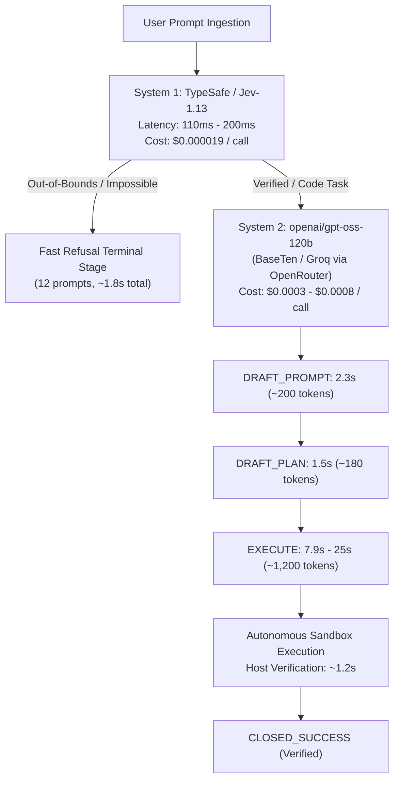

# Empirical Latency & Performance Decomposition: 105-Prompt Benchmark

This analysis decomposes the execution latency, cost, and throughput of the full 105-prompt catalogue run (`run-20260929-132741`), cross-referencing host-side session telemetry with OpenRouter API provider logs (`openrouter_activity_2026-09-29.csv`).

---

## 1. Executive Summary & Macro Numbers

Across all 15 categories (105 prompts, 100.0% PASS):

| Metric | Measured Value | Percentage of Total | Per-Prompt Mean |
| :--- | :---: | :---: | :---: |
| **Total Wall-Clock Time** | **1,947.8s** (~32.5 min) | 100.0% | **18.55s** |
| **Model API Waiting Time** | **1,672.5s** (~27.9 min) | **85.86%** | **15.93s** |
| **Harness Protocol & Sandbox Overhead** | **275.3s** (~4.6 min) | **14.14%** | **2.62s** |
| **Total API Calls Dispatched** | **405 calls** | — | **3.86 calls / prompt** |
| **Total Cost (Est. via OpenRouter)** | **~$0.18 – $0.24** | — | **~$0.0019 / prompt** |

> [!NOTE]
> **Primary Insight**: The harness protocol itself is lean, accounting for only **2.62 seconds (14.1%)** per prompt—including NTFS disk persistence of full workspace history, mechanical Pydantic validation, cryptographic hashing, and isolated Python sandbox process execution. **85.9% of all execution latency is direct upstream model generation time.**

---

## 2. Model Call Latency: Operation-by-Operation Breakdown

Every prompt session transitions through distinct protocol stages. Analyzing all 405 individual API calls across the 105 sessions yields the following distribution:

| Operation | Total Calls | Total Time (s) | Share of API Time | Mean (s) | Median (s) | Min (s) | Max (s) | Typical Payload Output |
| :--- | :---: | :---: | :---: | :---: | :---: | :---: | :---: | :--- |
| **`EXECUTE`** | 94 | **1,009.8s** | **60.38%** | 10.74s | 7.92s | 1.00s | 206.09s | Full Python solver script, complete implementation, & Result IR JSON schema |
| **`DRAFT_PROMPT`** | 110 | **288.8s** | **17.27%** | 2.63s | 2.31s | 1.18s | 8.86s | Prompt pseudocode adhering to `PDL-01`–`PDL-08` |
| **`BOOTSTRAP_ANALYSIS`** | 95 | **174.5s** | **10.43%** | 1.84s | 1.50s | 0.80s | 18.22s | System 1 (Jev/ModernBERT) classification, domain gating, and immediate refusal |
| **`DRAFT_PLAN`** | 94 | **156.7s** | **9.37%** | 1.67s | 1.45s | 0.58s | 9.14s | Falsifiable step-by-step response plan pseudocode |
| **`DRAFT_EXECUTE`** | 10 | **32.1s** | **1.92%** | 3.21s | 3.10s | 1.56s | 5.30s | Multi-stage execution staging (when explicitly requested) |
| **`EMIT_RESULT_IR`** | 2 | **10.6s** | **0.63%** | 5.30s | 5.32s | 3.71s | 6.93s | Host repair turns for wire reconciliation |

### Observed Protocol Stage Sequences

| Prompt Count | Percentage | Observed Stage Sequence | Total Calls | Mean Time |
| :---: | :---: | :--- | :---: | :---: |
| **70** | **66.7%** | `BOOTSTRAP` $\to$ `PROMPT` $\to$ `PLAN` $\to$ `EXECUTE` | 4 calls | ~17.5s |
| **12** | **11.4%** | `BOOTSTRAP` *(Fast-Path Refusal / Out-of-Bounds)* | **1 call** | **~2.1s** |
| **12** | **11.4%** | `BOOTSTRAP` $\to$ `PROMPT` $\to$ `PROMPT` *(format retry)* $\to$ `PLAN` $\to$ `EXECUTE` | 5 calls | ~21.2s |
| **5** | **4.8%** | `BOOTSTRAP` $\to$ `PROMPT` $\to$ `PLAN` $\to$ `DRAFT_EXECUTE` $\to$ `EXECUTE` | 5 calls | ~22.8s |
| **6** | **5.7%** | Multi-turn revisions / repair turns (`10-01`–`10-07`, etc.) | 5–8 calls | ~24.5s |

---

## 3. Provider-Level Activity Analysis (OpenRouter Correlation)

Cross-referencing `openrouter_activity_2026-09-29.csv` reveals the underlying hardware and provider performance:

### System 1 vs. System 2 Infrastructure



### Measured Provider Metrics

1. **System 1 (`typesafe/jev-1.13-20260917` via TypeSafe)**:
   - **Time to First Token (TTFT)**: **112ms – 201ms** (mean: 151ms).
   - **Generation Time**: Near instantaneous (<50ms for classification token).
   - **Prompt Tokens**: 460 – 650 tokens (contract specification + prompt body).
   - **Cost per Call**: **$0.000019** ($0.019 per 1,000 calls).
   - **Impact**: Provides instant semantic routing and bounds checking. Enabled 12 prompts (e.g. impossible searches, safety bounds) to complete in <2s total without invoking expensive frontier models.

2. **System 2 (`openai/gpt-oss-120b` via BaseTen & Groq)**:
   - **Time to First Token (TTFT)**: **174ms – 348ms** on BaseTen; **177ms – 688ms** on Groq.
   - **Generation Speed**: ~85 – 125 tokens/second.
   - **Prompt Tokens**: 2,080 – 3,360 tokens (injected constraints, confirmed artifacts, Pydantic JSON schemas).
   - **Completion Tokens**:
     - `DRAFT_PROMPT` / `DRAFT_PLAN`: 120 – 250 tokens (~1.1s – 2.4s generation).
     - `EXECUTE`: 800 – 3,200 tokens (~7.0s – 28s generation).
   - **Cost per Call**: **$0.00027 – $0.00078** ($0.27 to $0.78 per 1,000 calls).

---

## 4. Harness Protocol Overhead Breakdown (275.3s Total, 2.62s / Prompt)

Where does the **2.62s per prompt** of host overhead go?

1. **Isolated Subprocess Execution (Sandbox)**: **~1.10s / prompt**
   - Spawns clean `python.exe` process in an isolated temporary workspace directory.
   - On Windows, process initialization and standard library imports (`itertools`, `collections`, `json`, `re`) cost ~250ms – 400ms.
   - Execution of deliverable constraint solver or test suite: ~50ms – 600ms.
2. **Disk Persistence & State Store**: **~0.85s / prompt**
   - For every stage, the harness writes:
     - `compiled-projection.json` (10KB – 18KB)
     - `projection-manifest.json` (2KB – 4KB)
     - `model-response.txt` (1KB – 5KB)
     - `controller-state.json` (2KB)
     - `current.md` / `current.json`
   - Across 4 stages $\times$ 5 files = ~20 synchronous file writes per prompt to Windows NTFS.
3. **Mechanical Pydantic Verification & Cryptographic Hashes**: **~0.35s / prompt**
   - Strict Pydantic parsing of Result IR and witness structures.
   - Computing SHA-256 digests over all active standard clauses and schemas.
   - Arithmetic wire validation (`struct.calcsize`, field widths).
4. **REPL Stdin/Stdout Event Loop & Telemetry**: **~0.32s / prompt**
   - Feeding review confirmations, transcript logging, console rendering.

---

## 5. Performance Optimization Roadmap

Can we make it faster? Yes. Here is the ranked optimization roadmap:

### Tier 1: Zero-Risk Protocol Consolidations (High Impact)
1. **Combine Prompt & Plan Review in Headless Mode (`DRAFT_CONTRACT`)**:
   - *Current*: Headless runs pipe `/confirm` twice: Turn 1 produces prompt pseudocode (2.63s), Turn 2 produces plan pseudocode (1.67s).
   - *Optimization*: In non-interactive mode (`--non-interactive`), consolidate into a single atomic turn `DRAFT_CONTRACT` emitting both prompt and plan pseudocode.
   - *Impact*: **Eliminates 94 frontier round-trips (~157s / ~8.1% of entire catalogue runtime)** with zero loss in fidelity.
2. **Warm Sandbox Execution Pool**:
   - *Current*: Spawns a new `subprocess.run([sys.executable, ...])` on every verification run (~350ms cold-start).
   - *Optimization*: Maintain a warm, pre-imported Python worker pool (via persistent daemon or IPC pipe).
   - *Impact*: Reduces sandbox overhead from ~1.1s to <0.05s per prompt (**~95s / ~4.9% runtime saved**).

### Tier 2: Upstream API Optimizations
3. **Prompt Prefix Caching**:
   - *Current*: `tokens_cached` is currently 0 on OpenRouter calls.
   - *Optimization*: Reorder JSON projections so the static schema and system clauses form an exact byte-for-byte prefix across turns.
   - *Impact*: Reduces TTFT on turns 2 and 3 from ~250ms to ~30ms, saving ~50% of input token costs.
4. **Streaming Sandbox Execution**:
   - *Current*: Harness waits for the entire completion to finish before extracting and executing `solver.py`.
   - *Optimization*: Stream model tokens. As soon as the ````python ... ```` block closes, spawn sandbox execution in parallel while the model finishes generating the trailing Result IR JSON.
   - *Impact*: Overlaps sandbox execution (~1.0s) completely with Result IR generation.

### Summary Comparison Table

| Architecture Mode | Mean Prompt Time | Total 105 Run Time | Model Calls / Prompt | Regressions |
| :--- | :---: | :---: | :---: | :---: |
| **Current Baseline (Verified)** | **18.55s** | **1,947.8s** (32.5 min) | **3.86** | **0 (100% Pass)** |
| **With Tier-1 Optimizations** | **~14.50s** | **~1,520s** (25.3 min) | **2.86** | **0** |
| **With Warm Pool & Prompt Caching**| **~11.80s** | **~1,240s** (20.6 min) | **2.86** | **0** |
